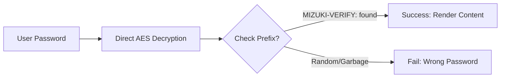

本文演示浏览器端的密码保护机制。出于让读者能打开示例的目的，密码被有意保留在仓库中；请勿将其复用于任何私有内容。

## 文章的 Front-matter

## 目录

- [文章的 Front-matter](#front-matter-of-posts)
- [文章文件放在哪里](#where-to-place-the-post-files)
- [文章的别名（alias）](#posts-alias)
- [工作原理](#how-it-works)
- [页面加密](#page-encryption)
- [字段说明](#fields)
- [解锁框长什么样](#how-the-unlock-box-looks)

<a id="top"></a>

<a id="front-matter-of-posts"></a>

```yaml
---
title: My First Blog Post
published: 2023-09-09
description: This is the first post of my new Astro blog.
image: ./cover.jpg
tags: [Foo, Bar]
category: Front-end
draft: false
---
```

| Attribute     | Description                                                                                                                                                                                                 |
|---------------|-------------------------------------------------------------------------------------------------------------------------------------------------------------------------------------------------------------|
| `title`       | 文章的标题。                                                                                                                                                                                      |
| `published`   | 文章发布的日期。                                                                                                                                                                            |
| `pinned`      | 是否将本文置顶在文章列表顶部。                                                                                                                                                   |
| `description` | 文章的简短描述，显示在首页。                                                                                                                                                   |
| `image`       | 文章的封面图路径。<br/>1. 以 `http://` 或 `https://` 开头：使用网络图片<br/>2. 以 `/` 开头：对应 `public` 目录下的图片<br/>3. 以上前缀都没有：相对于当前 markdown 文件 |
| `tags`        | 文章的标签。                                                                                                                                                                                       |
| `category`    | 文章的分类。                                                                                                                                                                                   |
| `alias`   | 文章的别名。文章可通过 `/posts/{alias}/` 访问。例如：`my-special-article`（即可通过 `/posts/my-special-article/` 访问）                                   |
| `licenseName` | 文章内容的许可证名称。                                                                                                                                                                      |
| `author`      | 文章的作者。                                                                                                                                                                                     |
| `sourceLink`  | 文章内容的来源链接或参考。                                                                                                                                                          |
| `draft`       | 若文章仍是草稿，则不会显示。                                                                                                                                                    |
| `encrypted`   | 文章是否启用了密码保护。                                                                                                                                                                    |
| `password`    | 用于解密该加密文章的密码。                                                                                                                                                                  |
| `passwordHint`| 帮助读者记住密码的提示，显示在密码输入框下方。                                                                                                                             |
| `hideHomeContent` | 是否隐藏公开的文章摘要，包括首页、 meta 标签、Feed/API 摘要和分享预览。当设置了 `password` 时默认为 `true`。                                      |

## 文章文件放在哪里

<a id="where-to-place-the-post-files"></a>

文章文件应放在 `src/content/posts/` 目录下。你也可以创建子目录，以便更好地组织文章及其资源。

```
src/content/posts/
├── post-1.md
└── post-2/
    ├── cover.png
    └── index.md
```

## 文章的别名（alias）

<a id="posts-alias"></a>

你可以通过在 front-matter 中添加 `alias` 字段，为任意文章设置别名：

```yaml
---
title: My Special Article
published: 2024-01-15
alias: "my-special-article"
tags: ["Example"]
category: "Technology"
---
```

设置别名后：
- 文章可通过自定义 URL 访问（例如 `/posts/my-special-article/`）
- 默认的 `/posts/{slug}/` URL 依然可用
- RSS/Atom 订阅源将使用自定义别名
- 所有内部链接都会自动使用自定义别名

**重要提示：**
- 别名**不应**包含 `/posts/` 前缀（该前缀会自动添加）
- 别名中避免使用特殊字符和空格
- 为获得最佳 SEO 效果，请使用小写字母和连字符
- 确保所有文章的别名互不重复
- 不要在开头或结尾添加斜杠

## 工作原理

<a id="how-it-works"></a>



## 页面加密

<a id="page-encryption"></a>

只需在 front-matter 中设置 `encrypted: true` 并提供 `password`，即可为任意文章启用密码保护：

```yaml
---
title: My Private Post
published: 2024-01-15
encrypted: true
password: "my-secret-password"
passwordHint: "Hint: The password is my dog's name"
hideHomeContent: true
---
```

### 字段说明

<a id="fields"></a>

| Field          | Required | Description                                              |
|----------------|----------|----------------------------------------------------------|
| `encrypted`    | Yes      | 设为 `true` 以启用密码保护              |
| `password`     | Yes      | 用于解锁文章的密码                          |
| `passwordHint` | No       | 在密码输入框下方显示的提示，用于帮助读者 |
| `hideHomeContent` | No   | 将公开摘要隐藏为 `该文章已加密`。当设置了 `password` 时默认为 `true`；设为 `false` 则显示正常摘要。 |

### 解锁框长什么样

<a id="how-the-unlock-box-looks"></a>

解锁框会显示以下内容：
- 主题主色色的锁图标
- 文章标题「Password Protected」
- 一段提示读者输入密码的说明
- 一条提示（若提供了 `passwordHint`）
- 密码输入框与解锁按钮

输入正确密码后，内容会被解密并显示。密码会保存在浏览器会话存储中，因此在同一会话内后续加载页面时，读者无需再次输入。
